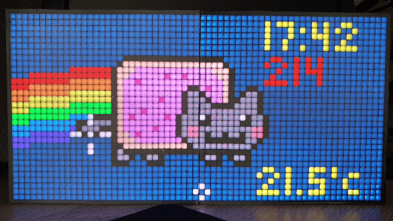
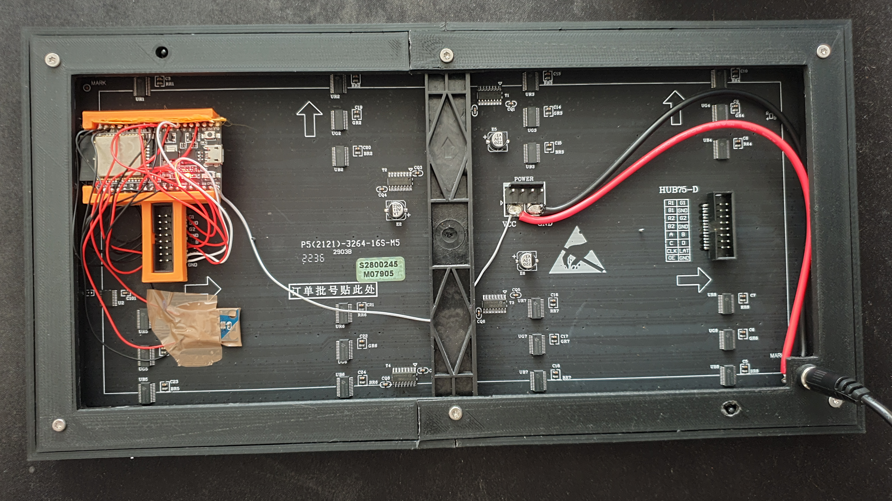
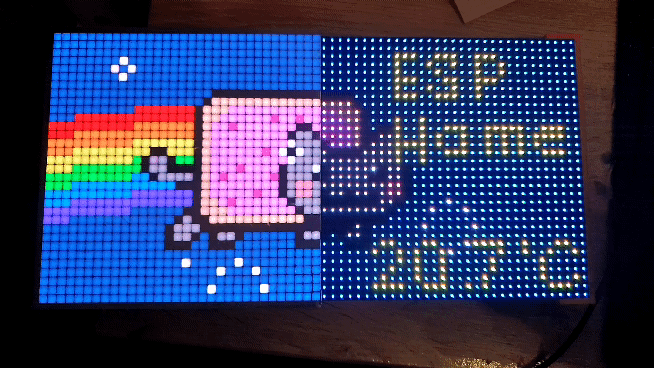

# ESP32-HUB75-MatrixPanel-I2S-DMA ESPHome wrapper [](https://github.com/TillFleisch/ESPHome-HUB75-MatrixDisplayWrapper/actions/workflows/ci.yaml)

This custom component is a [ESPHome](https://esphome.io/) wrapper for the [ESP32-HUB75-MatrixPanel-DMA](https://github.com/mrfaptastic/ESP32-HUB75-MatrixPanel-DMA#master) library. For more details regarding wiring, choosing the correct parameters and more complex configurations please refer to the above linked documentation.
This ESPHome component wraps the library into an ESPHome [display component](https://esphome.io/components/display/index.html) which can be used to show text, sensor values and images.

This wrapper currently only supports horizontally chained panels.
[Vertically aligned panels and VirtualDisplays](https://github.com/mrfaptastic/ESP32-HUB75-MatrixPanel-DMA/tree/master/examples/ChainedPanels) are currently not supported.

### My Pixel Art display

- 32x64 Pixel P5 Panel
- [CAD Files and more print info](https://www.printables.com/model/600039-pixel-art-matrix-display)
- retrofit ambient light sensor for adaptive brightness control


Backside|Raw panel
:-:|:-:
|  

# Configuration variables

The custom component can be added to a yaml configuration by adding the external component like this:

```yaml
esphome:
  name: matrix-display
  friendly_name: Matrix Display
  platformio_options:
    lib_deps:
      - SPI
      - Wire
      - Adafruit BusIO
      - adafruit/Adafruit GFX Library
      - https://github.com/TillFleisch/ESP32-HUB75-MatrixPanel-DMA#optional_logging

external_components:
  - source: github://TillFleisch/ESPHome-HUB75-MatrixDisplayWrapper@main

esp32:
  board: esp32dev
  framework:
    type: arduino
```

Note that the library dependencies are required and that the component will only compile on ESP32-based devices.
An example configuration can be found [here](example.yaml).

## Matrix Display

A minimum working example for setting up the display. A more complex configuration can be found [here](complex_matrix_config.yaml).

```yaml
display:
  - platform: hub75_matrix_display
    id: matrix
    width: 64
    height: 32
```

The additional settings are used to set the configuration variables for the wrapped display library. For more information on how to use these and their purpose please refer to the library's [documentation](https://github.com/mrfaptastic/ESP32-HUB75-MatrixPanel-DMA/tree/master) and [examples](https://github.com/mrfaptastic/ESP32-HUB75-MatrixPanel-DMA/tree/master/examples).

- **id**(**Required**, string): Matrix ID which will be used for entity configuration.
- **width**(**Required**, int): Width of the individual panels.
- **height**(**Required**, int): Height of the individual panels.
- **chain_length**(**Optional**, int): The number of panels chained one after another. Defaults to `1`.
- **brightness**(**Optional**, int): Initial brightness of the display (0-255). Defaults to `128`.
- **update_interval**(**Optional**, [Time](https://esphome.io/guides/configuration-types.html#config-time)): Determines the update frequency of the component. The min framerate setting of the display configuration is tied to this value. Defaults to `16 ms` which equals `62` frames per second.

- **R1_pin**(**Optional**, [Pin](https://esphome.io/guides/configuration-types.html#config-pin)): Pin connected to the R1 pin on the matrix display. Defaults to `25`.
- **G1_pin**(**Optional**, [Pin](https://esphome.io/guides/configuration-types.html#config-pin)): Pin connected to the G1 pin on the matrix display. Defaults to `26`.
- **B1_pin**(**Optional**, [Pin](https://esphome.io/guides/configuration-types.html#config-pin)): Pin connected to the B1 pin on the matrix display. Defaults to `27`.
- **R2_pin**(**Optional**, [Pin](https://esphome.io/guides/configuration-types.html#config-pin)): Pin connected to the R2 pin on the matrix display. Defaults to `14`.
- **G2_pin**(**Optional**, [Pin](https://esphome.io/guides/configuration-types.html#config-pin)): Pin connected to the G2 pin on the matrix display. Defaults to `12`.
- **B2_pin**(**Optional**, [Pin](https://esphome.io/guides/configuration-types.html#config-pin)): Pin connected to the B2 pin on the matrix display. Defaults to `13`.

- **A_pin**(**Optional**, [Pin](https://esphome.io/guides/configuration-types.html#config-pin)): Pin connected to the A pin on the matrix display. Defaults to `23`.
- **B_pin**(**Optional**, [Pin](https://esphome.io/guides/configuration-types.html#config-pin)): Pin connected to the B pin on the matrix display. Defaults to `19`.
- **C_pin**(**Optional**, [Pin](https://esphome.io/guides/configuration-types.html#config-pin)): Pin connected to the C pin on the matrix display. Defaults to `5`.
- **D_pin**(**Optional**, [Pin](https://esphome.io/guides/configuration-types.html#config-pin)): Pin connected to the D pin on the matrix display. Defaults to `17`.
- **E_pin**(**Optional**, [Pin](https://esphome.io/guides/configuration-types.html#config-pin)): Pin connected to the E pin on the matrix display. This is required for 1/32 scan panels.

- **LAT_pin**(**Optional**, [Pin](https://esphome.io/guides/configuration-types.html#config-pin)): Pin connected to the LAT pin on the matrix display. Defaults to `4`.
- **OE_pin**(**Optional**, [Pin](https://esphome.io/guides/configuration-types.html#config-pin)): Pin connected to the OE pin on the matrix display. Defaults to `15`.
- **CLK_pin**(**Optional**, [Pin](https://esphome.io/guides/configuration-types.html#config-pin)): Pin connected to the CLK pin on the matrix display. Defaults to `16`.

- **driver**(**Optional**): Driver used for configuring the display. Select one of `SHIFTREG`, `FM6124`, `FM6126A`, `ICN2038S`, `MBI5124`, `SM5266`.
- **i2sspeed**(**Optional**): I2SSpeed used for configuring the display. Select one of `HZ_8M`, `HZ_10M`, `HZ_15M`, `HZ_20M`.
- **latch_blanking**(**Optional**, int): Latch blanking value used for configuring the display.
- **clock_phase**(**Optional**, boolean): Clock phase value used for configuring the display.
- **use_custom_library**(**Optional**, boolean): If set to `true` a custom library must be defined using `platformio_options:lib_deps`. Defaults to `false`. See [this example](custom_library.yaml) for more details.

- All other options from [Display](https://esphome.io/components/display/index.html)

Note that the default pin configurations are the ones mentioned in the [ESP32-HUB75-MatrixPanel-DMA](https://github.com/mrfaptastic/ESP32-HUB75-MatrixPanel-DMA) library. Some of these pins are used as strapping pins on ESPs. It is recommended to not use these.
My panel and the ESP do not work unless I change the R2, G2 and B2 pins.

## Switch

This switch can be used to turn the display on or off. In it's off state the display is showing a blank screen.

- **matrix_id**(**Required**, string): The matrix display entity to which this power switch belongs.
- All other options from [Switch](https://esphome.io/components/switch/index.html#config-switch)

## Brightness

This number entity can be used to set the display brightness. In combination with a brightness sensor this can used to adaptively change matrix displays brightness.

- **matrix_id**(**Required**, string): The matrix display entity to which this brightness value belongs.
- All other options from [Number](https://esphome.io/components/number/index.html#config-number)

# Related work

- Library used in this Project: [ESP32-HUB75-MatrixPanel-DMA](https://github.com/mrfaptastic/ESP32-HUB75-MatrixPanel-DMA) by [@mrfaptastic](https://github.com/mrfaptastic)
